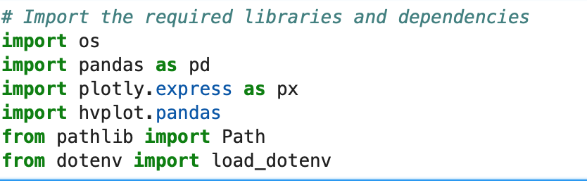
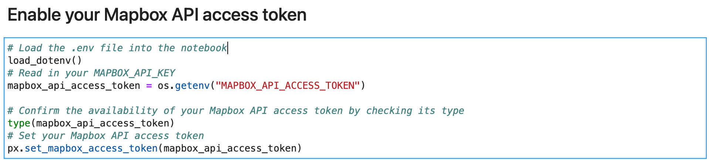
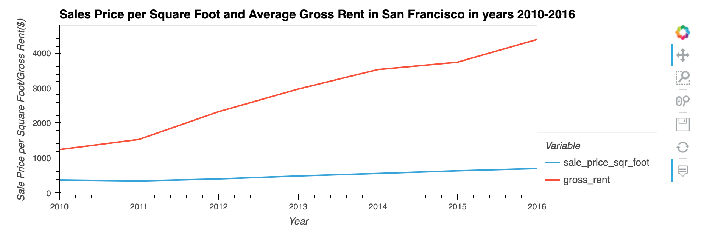
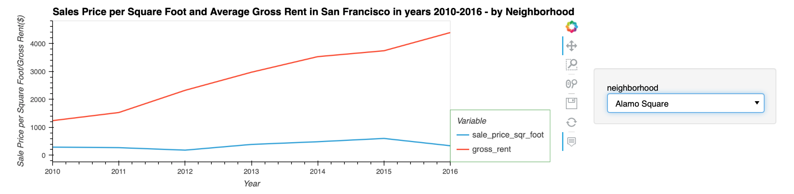
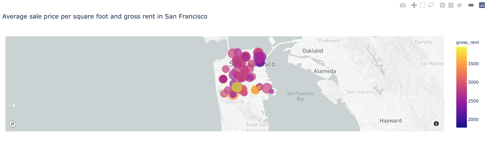

# Housing-rental-market-in-SF

This project analyses the potential market opportunity for a one-click service for people to buy properties and then rent them. A potnetial proptech company wants to have a trial of this offering in the San Francisco real-estate market and if the service proves popular, they can then expand to other markets.

This project leverages data visualizations, including aggregation, interactive visualizations, and geospatial analysis, to find properties in the San Francisco market that are viable investment opportunities.

---


## Technologies 
This project leverages python 3.7 with the following packages:
* Pandas - for financial calculations
* Path - for identifying the file
* os- provides functions for interacting with the computer's operating system.
* dotenv - for protection of API keys
* mapbox- software development kit needed for interaction with Mapbox
* hvplot - holoview plot for interactive visualisations
* plotly.express - for exploring goespatial data
 


## Installation guide 
Thsi project leverages python 3.7 with the following dependencies:

``` python

pip install python-dotenv
conda install -c plotly plotly=4.13.
conda install -c pyviz hvplot
conda install -c conda-forge nodejs=12
conda install -c conda-forge jupyterlab=2
jupyter labextension install jupyterlab-plotly@4.13.0 --no-build
jupyter labextension install @jupyter-widgets/jupyterlab-manager plotlywidget@4.13.0 --no-build
jupyter labextension install @pyviz/jupyterlab_pyviz --no-build
jupyter lab build

```
--- 
Import required libraries and dependencies:




---

In  order to run the application you need to set up an Mapbox account and obtain your perosnal API access token. You use this unique identifier to establish an authenticated, secure connection to  Mapbox API. 
For the security reasons you should store your unique API keys in a hidden file called .env
This file protects the content of the file by hiding it in the structure of the project. To display hidden files in Jupyterlab run the following command in your terminal:

``` python
jupyter lab --ContentsManager.allow_hidden=True
```
The project accesses the Mapbox api access token from the environment variables, and stores it in a Python variables named mapbox_access_token.



---

## Usage








## Contributors
Brought to you by Ksenia Gorska as part of the UC Berkeley Extension Bootcamp: UCB-VIRT-FIN-PT-06-2021-U-B-MW Ksenia Gorska
 e-mail: kseniagorska@icloud.com 
[linkedin] (https://www.linkedin.com/in/ksenia-gorska/)

## License

MIT